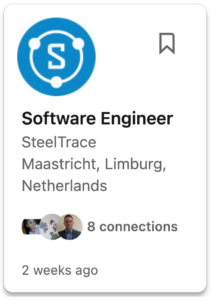

## New features on the platform

1. **Single sign-on**
2. **Biometrics log-in / signing** (using FaceID, fingerprint)
3. **QCP (Quality Control Plan) builder** (digitizing the negotiations and the final plan for the QCP, making the process more straightforward and less time-consuming for supply chain partners)
4. **Work-order based workflow** (workflow can be adapted to the internal work-orders, making it easier to integrate SteelTrace with current systems)
5. **Front-end redesign**

## ISO27001 certification

As data security is one of our core values at SteelTrace, our team is currently working on getting the ISO270001 certification. The ISO27001 standard provides a management framework for implementing an ISMS (information security management system) for all corporate data. Having an ISO27001 certification would mean that SteelTrace is independently and periodically audited on having this system correctly implemented.

## Expand the team

As SteelTrace is constantly growing and taking on new clients and projects, it is crucial that we also expand the team to keep offering an agile and impeccable service. We are currently looking for new developers to join our team, as well as other team members who could help us with the growing number of daily tasks and operations at SteelTrace. If you know anyone who might be interested, have them take a look at our LinkedIn page!

## Redesign the website

Our website is the first place you can go to if you need information about SteelTrace. But we believe that the current website structure might not be answering all the questions you have about us. So our marketing team is currently working on making the website more user-friendly, coherent and relevant for everyone who want to know more about SteelTrace. We are also planning to offer some free content and resources based on our expertise in the industry and in blockchain technology. Stay tuned!

If you want to know more about SteelTrace, make sure to sign up for a product demo! We have one every Thursday and you can register using the link below:

[Sign up for Product Demo](https://calendly.com/tom-steeltrace/demo-of-the-steeltrace-platform?month=2022-04)
