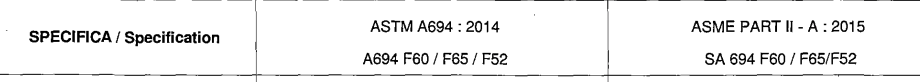
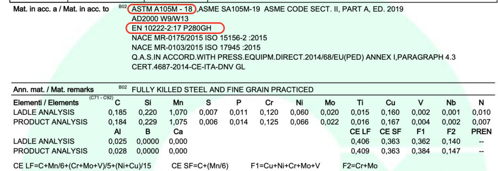

We all know that manufacturers issue certificates according to their best knowledge of the product specifications, project requirements, material standards, construction codes, etc. However often they contain errors: declarations are missing, material specifications are wrongly spelled, acceptance criteria are not mentioned.

Why this? The reasons may be multiple: certificates are prepared by simply copy-paste from previous purchase orders, people doing certificates may not have all required technical background experience. Too often we think of the certification work as simple administrative work. It’s not, it actually requires a highly specialist person that knows almost everything about materials and specifications. We developed this little guide to help people avoid the most common mistakes that we face daily.

## 1. ASME/ASTM dual certification

It is common practice to state that the final product complies with ASME and ASTM requirements. This compliance may be expressed in various form such as:

- Material compliant with ASME Boiler and Pressure Vessel Code Section II – SA182 F316 and ASTM A182 F316
- Material according to ASTM/ASME A/SA-182 F316
- Material ASTM A182 F316 / ASME SA182 F316

While generally view this as an accepted normal practice, there are a few caveats:

- **Be careful for material not part of ASME Code Section II**, such as ASTM A694. For this reason A/SA694 is not correct
- **Be careful when stating the edition of the standard** and the requirements to comply with. As an example, at the time of writing this article the current version of ASTM A210 is 2019, while the ASME Code is in 2021 edition, and it contains the specification SA210 which refers to ASTM A210 from 1995

## 2. EN/ASTM dual certification

EN/ASTM dual certification is also a common practice that is widely accepted. This may happen when the material is in compliance with all the requirements (chemical composition and mechanical properties) of both the standards.

This certification usually may be expressed with statements such as:

- Material compliant to ASTM A182 F91 and to EN 10222-2 X10CrMoVNb9-1

This practice is not as common as the ASME/ASTM dual certification, but still is frequently used. It’s not a big issue, but the following should be kept in mind when doing it:

1. **Heat treatment temperature.** Heat treatment temperatures may be different. As an example, EN 10222-2 X10CrMoVNb9-1 requires austenitizing at 1040-1090 °C and tempering at 730-780 °C, while the “equivalent” ASTM A182 F91 has an austenitizing range 1040-1080 °C and tempering at 730-800 °C.
2. **Test sampling frequency**. As an example, the standard EN 10222-2 requires the test sampling frequency to be compliant to EN 10222-1, which states that the frequency is affected also by the weight of the parts. For forgings with weight over 4000 kg, test shall be performed on each end of each forging in two diametrically opposite areas. This requirement is not captured by ASTM, which simply allows testing for heat and lot
3. **Tensile test specimen size**. The two standards have different requirements for tensile test specimen diameter: ASTM requires 12.5 mm as standard sized specimen, while EN requires 10 mm. If tests are performed using an ASTM specimen, then the material cannot be declared to be compliant to EN standards

## 3. Declaration of non destructive examination

In certain occasions, particularly for standard products, the issue of a separate certification for Non Destructive Examinations (NDE) is not required, but a simple statement may be enough. Roughly speaking, NDE indications may have two thresholds:

- **Record threshold:** any indication exceeding the record threshold shall be recorded. The product is still acceptable
- **Acceptance threshold:** any indication exceeding the acceptance threshold shall cause the rejection (or repair) of the product

NDE declaration that are commonly seen in certificates are vague, such as:

- NDE OK
- UT performed – OK
- PT performed without objection
- MT conform

These declarations not only lack two important parts of information: test standard and the acceptance criteria, but also don’t provide any clear information about the test result:

1. Was any indication found?
2. If so, was it acceptable, or was it repaired?

As an example, a better statement would be something like: “Magnetic particle test performed according to ASTM E709, with acceptance criteria as per ASME Section VIII Appendix 6. No indication exceeding the acceptance criteria”

## 4. Wrong test requirements

Each material specification has its own test requirements. This may be obvious, however we find many mistakes in certificates where the tests are not performed in accordance with the specification. As an example, suppose we are manufacturing a forging made of ASTM A105. It is normal practice for a manufacturer to take test specimens from mid thickness (1/2 T) because it’s the most stringent condition, however if we look at the material specification, it says that “the central axis of the test specimen shall be taken at least 1⁄4 T from the nearest surface as-heat treated”. And the verb used is “shall”. Which means that no exceptions – even if more stringent – are allowed.

## 5. Missing acceptance criteria

While technically it is not a mistake, it should be common practice to include acceptance criteria of tests. If the material is declared to be ASTM A105, we all know what the acceptance criteria are. However, it’s really useful for the reader to have acceptance criteria stated in the certificate, to allow for an easy check of compliance to the requirements.

### Get Whitepaper on Preventing Counterfeiting

Click here to get our Whitepaper on Preventing Counterfeiting, to learn more about counterfeiting and how SteelTrace solves this issue.

By the way, are you still doing manual checks of your certificates? Have you ever thought about an automatic and compliant-by-design check of requirements? [Browse our website](/) to discover more!

If you want to know more about SteelTrace, make sure to sign up for a product demo! You can register at your preferred time using the link below:

[Sign up for Product Demo](https://calendly.com/tom-steeltrace/demo-of-the-steeltrace-platform?month=2022-04)
