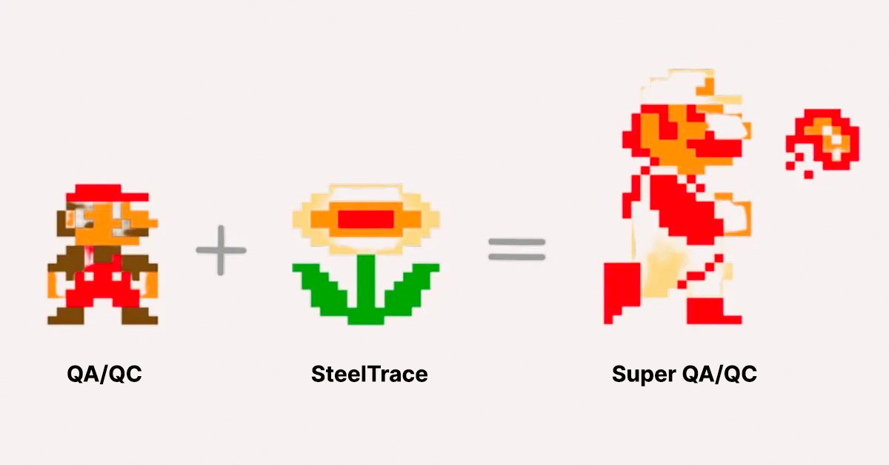
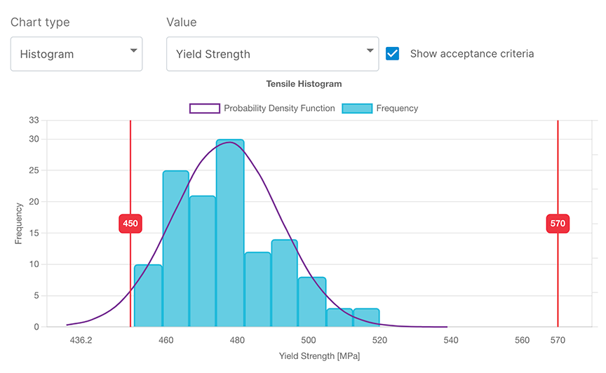
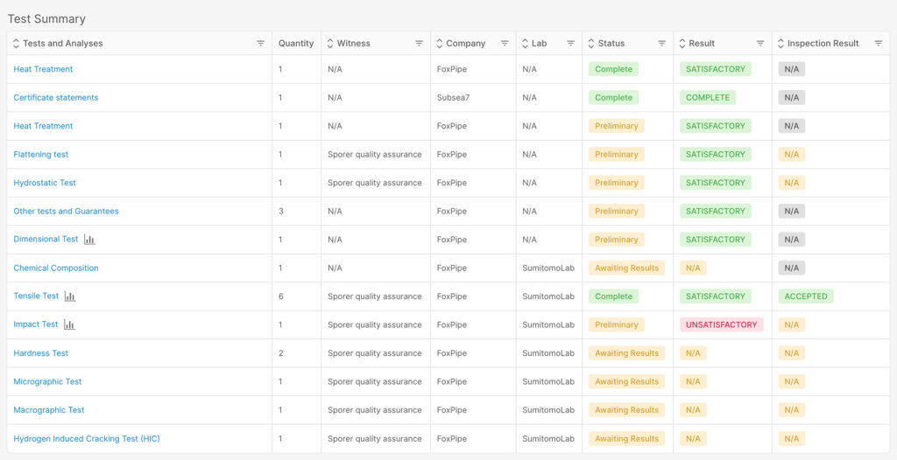

Quality management is crucial in the steel supply chain for oil and gas, where high risks, stringent quality standards, and complex requirements exist. However, manual, time-consuming, and human error-prone processes have posed challenges for quality managers. SteelTrace offers a solution to these issues. Here, we present the five key ways in which the SteelTrace platform improves quality management.

### 1. Automated Non-Conformity Detection:

During manufacturing campaigns, quality control involves capturing thousands of data points. Traditionally, these data points are manually checked against requirements, leading to inefficiencies and potential errors. SteelTrace digitizes customer requirements and captures structured data, enabling automated checks that instantly flag non-conformities.

### 2. Standardization Across Manufacturers:

Working with multiple mills and manufacturers often involves receiving documentation in various formats, creating complexity and hindering efficient analysis. SteelTrace overcomes this challenge by providing all documentation, regardless of the supplier, in a unified format. This standardization streamlines the process of digesting and comparing information, ensuring consistent quality across the supply chain.

### 3. Automated graph generation:

Examining individual data points only reveals compliance with specifications, but fails to capture valuable trends. To identify trends across thousands of data points, visual representations are essential. SteelTrace generates graphs such as histograms, box plots, and violin plots based on supplier data, enabling quality managers to identify trends, assess material adherence to specifications, and evaluate material homogeneity effectively.

### 4. Real-Time Data and Certification Status:

SteelTrace captures and delivers data in real-time, empowering quality managers with up-to-date information. Moreover, the platform facilitates a digital workflow for inspectors and QA/QC personnel to sign off on information in real-time. This real-time access ensures quality managers have a live status of the certification process, allowing for timely interventions and improved efficiency.

### 5. Comprehensive Dashboard:

With a continuous flow of real-time data from diverse sources, SteelTrace offers a user-friendly dashboard as an essential tool. Rather than dealing with a multitude of emails or large file transfers, the platform neatly organizes all data in a centralized dashboard. Quality managers gain an instant overview of orders, with specific details, such as mechanical properties, just a click away. This comprehensive dashboard optimizes time management and facilitates focused attention where it is most needed.

In conclusion, SteelTrace significantly enhances quality management by providing traceable, secure, and real-time data access to all stakeholders in the steel supply chain. By ensuring strict adherence to standards and requirements, SteelTrace improves the quality of steel products and associated processes. SteelTrace empowers quality managers, elevating quality control and assurance to a new SUPER level.

Interested in more? [Join our weekly demo ( No obligations ).](/weekly/)
