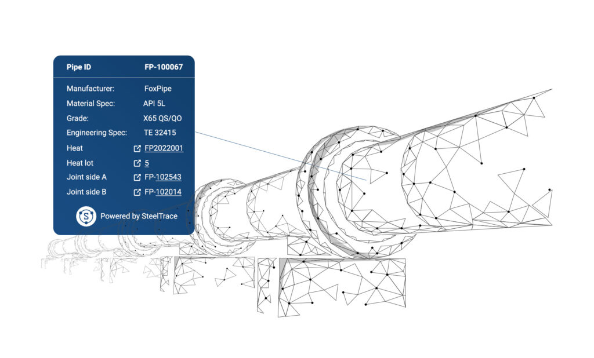
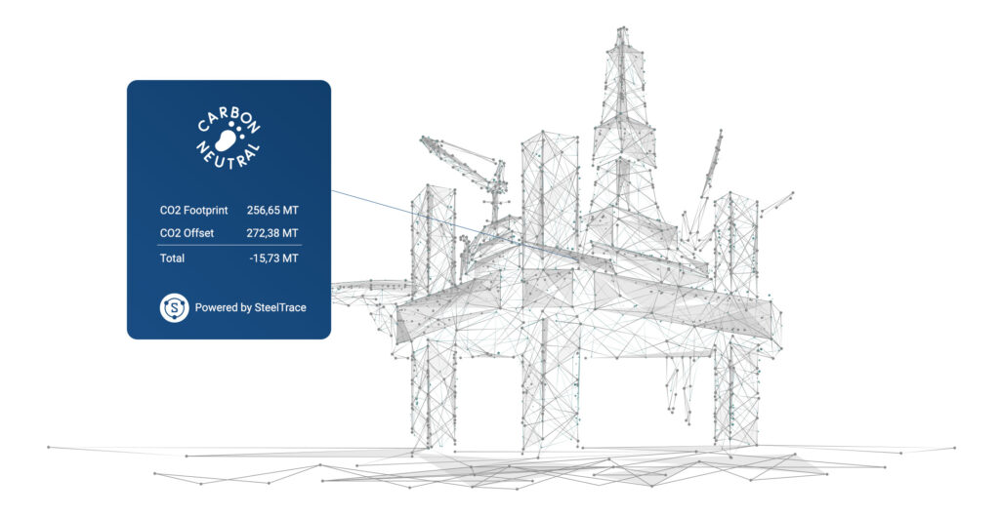

We know why we want a digital twin. Things like predictive maintenance, unmanned facilities, root cause analyses, simulations for turn around planning etc. The exact implementation however is still unclear.

Some think about 3D models and a HoloLens. Others think about up-to-date digital drawings of a plant. We think about a combination of both plus adding in data from the earliest stages of the manufacturing of the products used in a lab.

Here are 6 data points you might want to add to your digital twin solution.

## 1. GPS data

Especially for off-shore pipelines, you want to know exactly where each pipe is installed. If there is a problem, you should be able to instantly know which pipe has the problem and find additional information on the pipe so you can plan repairs accordingly.

## 2. Weld and NDT records

If there is a leakage or failure on a weld, you’ll want to find the corresponding WPS, [NDTs](/blog/6-to-look-for-ndt-reports/) and qualifications test reports quickly. Having them stored in your digital twin can make them accessible with a few clicks, instead of having to search through loads of [pdf files or physical folders.](/blog/what-do-we-mean-with-truly-digital/)

## 3. Chemical properties, corrosion tests and dimensional data

Now why put those three in one point? When doing a [life extension study](/blog/life-extension-of-assets-in-the-oil-and-gas-industry-cradle-to-grave-traceability-part-3/), you might want to determine how far the material has degraded over time. By combining the nominal wall thickness, corrosion test results and the chemical composition, together with usage data and on-site inspection data, you can create a more accurate model on how much the item might have degraded over time and plan effective and efficient maintenance activities. It can also help with predictive maintenance!

## 4. Heat, lot and manufacturer information

What does this matter once the product is approved and used in production? Why would you need this information? What if there is a problem, and the analysis you perform makes you think it’s caused by the material or the way the product was manufactured? You might be using the same material in other parts of your plant. Having a digital twin that has this information stored properly can help you instantly find where else you have used this product and replace it before any more damage is caused.

## 5. Finite Elements Analysis (FEA) results

When you design a product using FEA, you have a clear distribution of forces and momentums on the product, be it a single forging or a whole pipeline, and you can easily identify the areas with the highest concentration of stresses. By inputting this data in your digital twin, you are sure that you will inspect those areas first.

## 6. On site inspections

It is important that digital twins are kept up-to-date. This also means that you want to have the current state of you equipment or plant. Adding on site inspections into your digital twin makes sure that you have the latest accurate “state” of your equipment.

## BONUS 7. **Carbon Impact**

Having trustworthy data from the manufacturing process like steel weight, steel composition, furnace type and transportation distances can help you get a nice estimate of the carbon footprint of the products you used to built your facility. Adding that all up can help with reporting carbon impact by the CAPEX team and meet the legal requirement to do so.

SteelTrace can be deployed on a supply chain to help you capture all this data in a structured format and add it into any digital twin solution you might have.

Do you want to learn more? Sign up for our [weekly demo](/weekly/).
