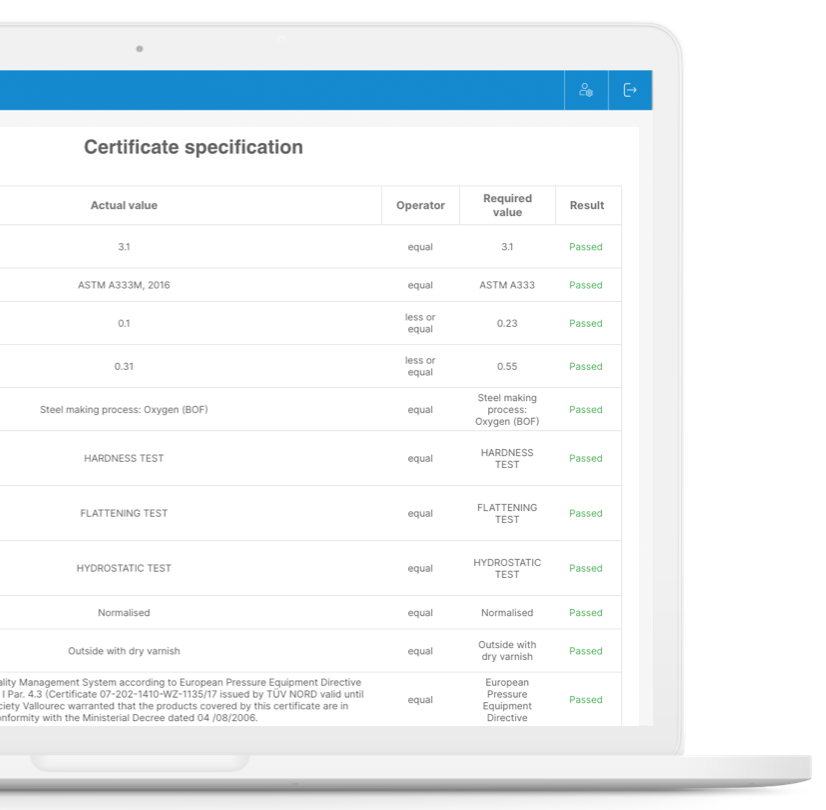

Nowadays, sustainability is an urgent concern in all fields. And even though steel is considered to be a sustainable material, its production is still very energy-intensive.

But the processes can become more sustainable than they currently are, even in the oil and gas industry. How? SteelTrace provides innovative solutions to reduce your company’s carbon footprint.

This blog post will describe six ways in which you can make your company more sustainable.

## 1. Paperless office

Steel Trace is a **digital platform**. This means that no PDFs and paper certificates need to be printed, signed, stamped, and scanned anymore. SteelTrace can make these **processes entirely automated**, eliminating all redundant manual steps and physical documents. By doing so, your office’s processes can become more effective and sustainable at the same time.

## 2. Life extension of assets

In the oil and gas industry**,**safety and material dataare top priorities. Knowledge about the production history and detailed structured data of individual products can ensure a better prediction of when they must be replaced. This will **prevent unnecessary premature replacing**, therefore extending the lifespan of assets and preventing waste of raw material.

SteelTrace makes this possible by offering**Cradle-to-Grave traceability** for every individual product and all of it’s properties down do the smallest detail. This makes the production processes not only safer and more cost-effective, but also significantly more sustainable.

## 3. Reduction of non-conformities

SteelTrace provides an online platform in which structured data from the whole supply chain is **stored and verified in real-time** by suppliers, manufacturers, customers, and all other involved parties.

This enables the **early detection of non-conformities** throughout the entire production process, making sure that no materials are wrongfully wasted on faulty products. By drastically decreasing non-conformities and material waste, your company can then greatly reduce its environmental impact and carbon footprint.

## 4. Recyclability of steel products

Due to steel’s different properties and compositions, its recycling is not an easy process. Often, the type of steel used in products is unknown, which means that it requires a lot of energy to recycle it while guaranteeing the same level of quality.

This process can become more efficient and sustainable thanks to **blockchain technology**. Blockchain allows the identification and traceability of each piece of steel, **storing all structured data in a decentralized database** accessible to all parties.

By identifying each piece of steel and its properties, it is possible to detect the steel products that are ready to be recycled and how to recycle them. This ensures consistent and efficient recycling, which consequently will reduce excessive carbon emissions and improve your carbon footprint.

## 5. Reduction of human errors and delays

Manually verifying certificates, product specifications or test results takes lots of time. Human errors can easily arise.

To avoid this, SteelTrace provides **automated data verification**. This eliminates time-consuming quality management manual tasks, reducing possible errors and delays, which could have enormous consequences on the usage of materials and recyclability. Automated verification guarantees that these processes are both time-efficient and sustainable.

## 6. Carbon footprint tracking – Coming soon!

SteelTrace wants to make processes in the oil and gas industry more sustainable and that’s why it has introduced all the innovations explained above.

However, it wants to take a step even further. SteelTrace aims to add the carbon emissions of each company on certificates. In this way, companies are able to keep track of their carbon footprint and make adjustments in their processes to try reducing it.

**SteelTrace can help you and your company make sustainable decisions and reduce your environmental impact.**

If you want to know more about SteelTrace, make sure to sign up for a product demo! You can register at your preferred time using the link below:

[Sign up for Product Demo](https://calendly.com/tom-steeltrace/demo-of-the-steeltrace-platform?month=2022-04)
