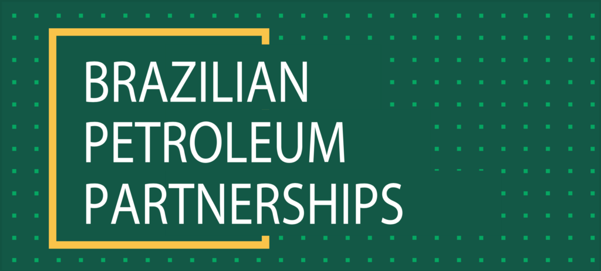

## About the BPP program

The BPP program is managed by [ApexBrasil](https://apexbrasil.com.br/) (Brazilian Trade and Investment Promotion Agency) and has for objective to develop partnerships between Brazilian and foreign companies to “strengthen the supply chain and develop investment opportunities” for the oil and gas industry in Brazil.

The program also seeks to develop partnerships that will leverage innovation and technology for Brazilian companies.

## Partnership with the BPP program

Carlos Eduardo Padilla Costa from the BPP program said:

“Our goal in the BPP program is to identify new technologies and innovative solutions that will strengthen the supply chain of the Oil&Gas industry in Brazil and abroad. Today, our portfolio includes more than fifty Brazilian companies that are looking for fruitful partnerships with international companies for business and investment developments.”

Tom Meulendijks, CEO of SteelTrace said:

“For SteelTrace, this is a first step to explore localization in the Brazilian market and expanding our business there, and a great opportunity to collaborate with Brazilian companies. We are excited to be part of the BPP program and are looking forward to future partnerships for idea exchange and innovation.”

We are looking forward to a successful partnership!

For more information you can contact us [here](/contact/).
