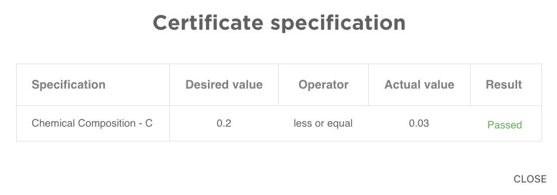
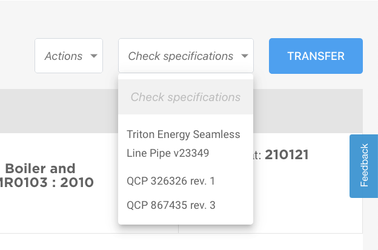

All these parties from now on can make use of an automatic verification of certificates, by uploading desired specifications in an online environment. Because of the 24/7 characteristic and error-free interpretation of data, every link in the system benefits from the online environment of an independent partner within the supply chain. Check an example of the specs checker, where we verify if the carbon value is within your custom parameter.

## Example ruleset

## Why is this important?

At this moment certificates and rulesets are being compared on paper. This often goes well, but still has two important drawbacks. The data is viewed by people, which increases the chance of human error. When the ruleset and the certificates are put on top of each other by an online platform, it becomes clear instantly whether the information corresponds to each other.

But reducing human error is not the only advantage of an online system like this. That’s because every piece of steel only occurs once in the system, so copying certificates is impossible. This means that the online platform also directly verifies the quality of the product for the end-user. This prevents errors and completely eliminates the risk of fake certificates within the supply chain.

## Example of the specifications checker

Imagine that someone in your company purchases a steel pipe and verifies all important specifications. This persons sees that the steel meets all requirements and decides to use the steel for a big project. After a few years, disaster strikes. What went wrong? Well, the values might have been checked, but not the temperature at which those values were measured. This steel pipe was used in ice-cold conditions of -50 degrees Celsius, but the values were verified for much higher temperatures.

With the spec checker, this human error could have been avoided. Just by filling in all the important data and requirements. The specifications checker would tell immediately if the product fits the requirements, under the right conditions.

## How does the specification checker work?

In order to keep all data structured, it is crucial to use a single platform containing all certificates that were created at the beginning of the supply chain. The specifications checker then offers the unique opportunity to upload specifications and rulesets to the platform. This results in a kind of automatic search, allowing existing pieces of steel to be verified against the ruleset uploaded by the user.

## SteelTrace as a neutral partner within the supply chain

SteelTrace found that many projects in the steel industry unnecessarily spend loads of time and money checking and verifying certificates, because they are using paper documents. We believe there are too many people involved in this process, so the risk of human error is greater than necessary.

That’s why SteelTrace, as an independent partner within the steel supply chain, developed an online platform that uses blockchain technology to create an environment where structured data can be verified in real-time and where data is always immediately available to everyone within the supply chain. We strongly believe that this is going to be the next step of the innovation process within the steel industry.

Wondering if SteelTrace can also help your company with innovation in the field of rule sets and certificates? [Contact us today.](/contact/)
