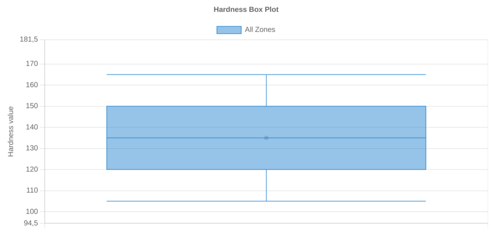
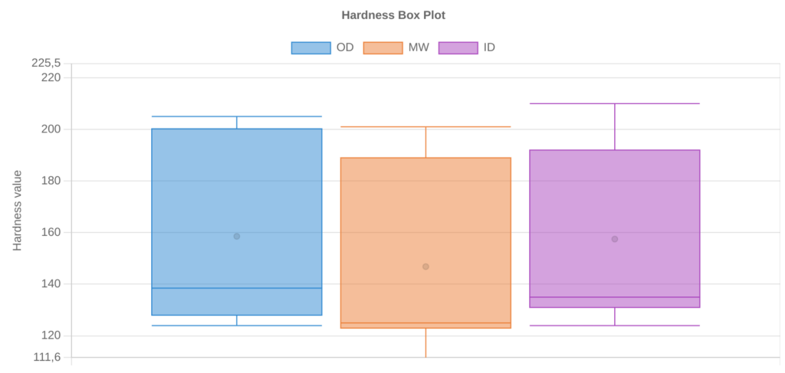
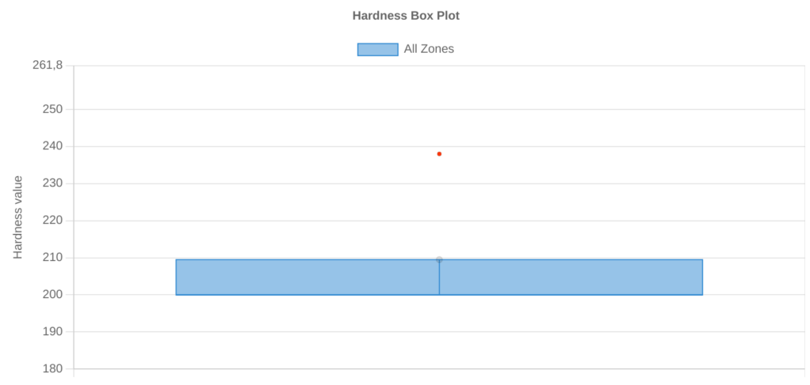
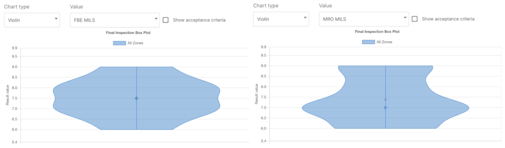

## Box plots

A box plot uses boxes and lines to depict the distributions of one or more groups of numeric data.Put in simple words, it is a type of plot that displays the five number summary of a dataset, which includes:

- The minimum value
- The first quartile (the 25th percentile)
- The median value
- The third quartile (the 75th percentile)
- The maximum value

And why are box plots useful? Think about the hardness test on a pipe. According to API 5L, the pipe must be tested in 4 quadrants, three locations, 4 indentations each, which leads to 48 hardness values per pipe. Wouldn’t it be very usefule if we could have an easy and fast way to compare all hardness test for each tested pipe of each heat? Or compare the hardness values among the heats?

Well, a box plot allows that!

A box plot is useful for:

### 1. Visualising the distribution of values in a dataset

A box plot allows us to quickly visualize the distribution of values in a dataset and see where the five number summary values are located.

### 2. Comparing two or more distributions.

Side-by-side box plots allow us to visualize the differences between two or more distributions and compare the median values and the spread of values between distributions.

### ****3. Identifying outliers.****

In box plots, outliers are typically represented by points that extend beyond either whisker. An observation is defined to be an outlier if it meets one of the following criteria:

- An observation is less than Q1 – 1.5*(Interquartile range)
- An observation is greater than Q3 + 1.5*(Interquartile range)

By creating a box plot, we can quickly see whether or not a distribution has any outliers.

## Violin plots

Simply put, violin plots are a method of plotting numeric data and can be considered a combination of the box plot with a kernel density plot (KDE). In the violin plot, we can find the same information as in the box plots:

- The minimum value
- The first quartile (the 25th percentile)
- The median value
- The third quartile (the 75th percentile)
- The maximum value

The unquestionable advantage of the violin plot over the box plot is that aside from showing the above mentioned statistics it also shows the entire distribution of the data. To go further, let’s see why violin plots are useful. Think about a coated pipe. Typically you have two layers of coating (such as FBE and MRO), and – as in process inspection – you may measure the thickness of each layer. Let’s say that you do this measure in 4 equispaced points, every 500 mm of pipelength.

You may represent and compare these data by using the box plot that we sow earlier.However in this case, it may seem that the thickness is more or less the same: the minimum and maximum values are the same, and also median and quartiles. But if we plot the data using a violin plot, showing also the distribution of the values, we can then see that there is indeed a difference! The major part of thickness for FBE is around 7 mils and 8 mils and it is more or less uniform, while for the MRO layer the major part of the measured points have a thickness of 7 mils.

To conclude, a well-known adage says, “a picture is worth a thousand words.” So why should you limit yourself to just perform a lot of tests, only because they are required by the standard, without being able to gather real insights from them? We have just seen two different charts that are able to convey data sets in a format that helps you understand the data and any trend that lies within them, to improve your processes and avoid repetition of errors.

Like our blog posts? be sure to follow us on [LinkedIn](https://www.linkedin.com/company/steel-trace/)!
