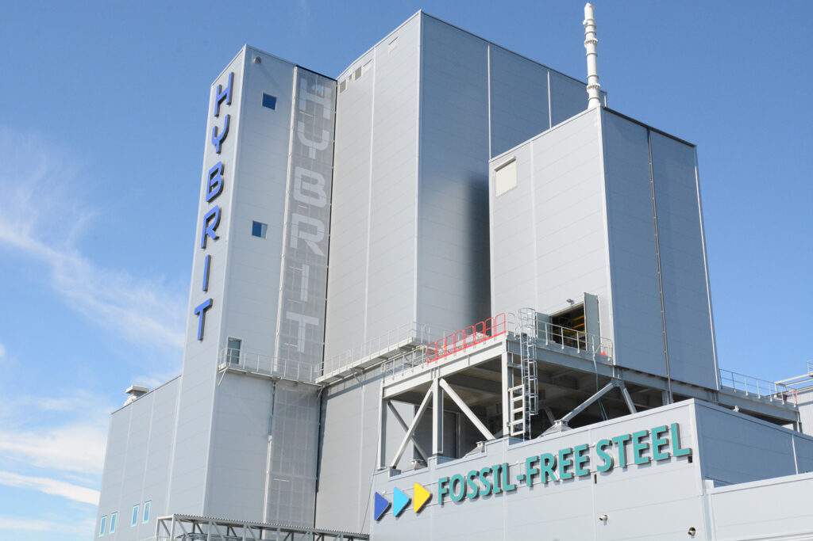
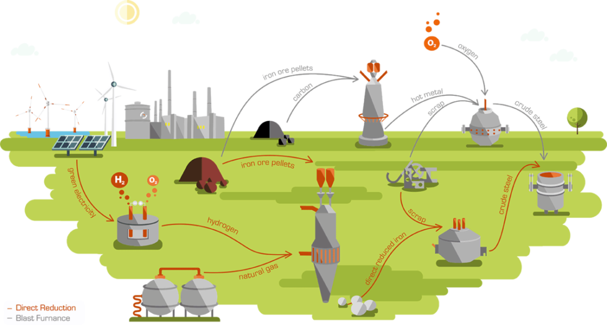

European steel makers are responding to the challenge of cutting emissions to combat global warming. Although some companies are moving faster than others, the general direction is clear.

## Energy-intensive

Ever since Great Britain’s industrial revolution, steel making has been an energy-intensive business. It has been, and still is, indissolubly linked with the coal industry. Indeed, the two industries at first depended on each other: steel needed coal to the smelt iron ore, and coal needed steel in the form of railway tracks to transport it to market.

## Decarbonization

As steel making grew into a mass industry, it quickly evolved to become more efficient, in terms of both output per worker and energy consumption. But despite the enormous strides made throughout the 20th century, steel making is still responsible for at least 7% of CO² emissions world-wide. To put it another way, for each tonne of steel, just under two tonnes of CO² are released into the air.

EU targets call for a 40% cut in greenhouse gas emissions from 1990 levels by 2030 and full climate neutrality by 2050. European steel mills are in the front line in this battle. The effort is being overseen by “Green Steel for Europe” (GREENSTEEL) and supported by subsidies from EU member states. Important players include Sweden, Finland, Italy and Germany, this last a manufacturing powerhouse that urgently needs to reduce its carbon footprint and where the Green Party exerts considerable pressure.

## HYBRIT

So, is fossil-free steel making a pipe dream or a realistic concept? Perhaps the answer can be found in a bold initiative under way in Sweden and Finland. Steel maker SSAB has teamed up with iron ore producer LKAB and energy giant Vattenfall in a bid to replace coking coal with fossil-free electricity and hydrogen in the steel making process. The venture is called HYBRIT, which stands for “Hydrogen Breakthrough Ironmaking Technology”. SSAB aims to be the first steel company in the world to bring fossil-free steel to the market already in 2026. SSAB’s aim is to be fossil-free as a company by 2045.

In traditional steel making CO² emissions are the result of a chemical reaction in the blast furnace, where coking coal is used to melt iron ore, a process which also reduces it, i.e., strips it of oxygen. After the molten iron containing dissolved carbon from the blast furnace is placed in a vessel called a converter, oxygen is forced through the furnace at high speed to expel the carbon and other impurities. This process is sometimes called “basic oxygen steelmaking” and is by far the most common technology in current use.

The HYBRIT project replaces molten iron with direct reduced iron (DRI), coke with hydrogen and the blast furnace plus converter with an electric arc furnace. DRI, also known as sponge iron, is obtained by reducing iron ore in a solid state, requiring much lower temperatures, thereby saving energy. And whereas in the past the reducing agent was more often natural gas, HYBRIT is taking the plunge and using the more expensive hydrogen, electrolyzed from renewable energy sources, in a bid to dispense with fossil fuels altogether.

SSAB plans to convert the blasting furnaces at its mills in Sweden and Finland with electric arc furnaces. Naturally, this electricity is fossil-free, sourced mainly from abundant hydropower and wind power resources in the vicinity. SSAB also aims to run its Iowa mill on renewable energy by 2022.

On 31 August 2020, HYBRIT started up the world’s first pilot plant for fossil-free steel at the SSAB site in Luleå, Sweden. Here hydrogen, produced by electrolyzing water with fossil-free electricity, is used to reduce iron ore into DRI. (Natural gas will also be used in order to make a comparison.) After the DRI has undergone reduction, it is added to an electric arc furnace together with recycled scrap to complete the primary stage of steel making.

*The HYBRIT pilot plant in Luleå, Sweden.*

## Natural gas or hydrogen?

At the moment the jury is out as to whether natural gas or hydrogen is the more viable reducing agent. Hydrogen is produced either by reacting a fossil fuel or biomass with steam or, more rarely, through electrolysis. Electrolysis through renewable electricity is by far the most environmentally friendly production method, but if steel price hikes are to be avoided it must become cheaper and more widely available. This could be achieved by government subsidies and/or the scaling back of subsidies for fossil fuels. Natural gas is cheaper and has been widely used in the USA since the shale gas revolution. It is an improvement on coal, certainly, but it is a non-renewable fossil fuel nonetheless.

## European projects

European mills have also been converting from coal to natural gas, but some have gone further, researching and testing hydrogen as the key to a fossil-free future. For instance, Ovako uses LNG to heat its rolling mills, but is also pioneering hydrogen supplied by Linde at its Hofors steel mill. HYBRIT is also experimenting with natural gas as reference before switching over to hydrogen in line with its aim of eliminating fossil fuels.

Other European companies are taking steps to decarbonize steel making, at least partially. ArcelorMittal’s goal is to cut its CO² emissions by 30% by the end of the decade. In 2020 it started using hydrogen to produce steel and aims to expand this in the near future. Its Dunkirk facility will host the implementation of a hybrid BF/DRI technology. At its Hamburg facility the company will test the ability of hydrogen to reduce iron ore and form DRI on an industrial scale.

Thyssen Krupp is involved with two projects. With energy producer RWE it is planning an electrolyzer at its Duisburg mill, and others are to be built at Lingen. Hydrogen pipeline transport also forms part of this project. The German steel company has also received a government grant to build an alkaline electrolyzer for the production of hydrogen and ammonia in Saudi Arabia’s futuristic green city, Neom.

Salzgitter, also with help from the German government, will convert its blast furnace in the next two years, hydrogen taking the place of coking coal. Last year a test plant was already commissioned in Luleå, Sweden. Salzgitter’s decarbonized production process, called SALCOS®, is being developed in partnership with the Fraunhofer Institute and other bodies. In November last year the German company’s Peine mill produced its first low-CO² steel slab.

*Graphic of the SALCOS® functionality for the integration of a direct reduction reactor for CO² reduction. Image: Salzgitter.*

Italy is also venturing into “green steel”. EDF-owned Italian utility Edison, Tenaris and energy infrastructure specialist Snam have joined forces to develop a 20MW hydrogen electrolyzer at Tenaris’s steel pipe facility at Dalmine. The electricity will probably be generated from Edison’s solar or wind power assets. The consortium is also looking at storage of both hydrogen and the oxygen produced during electrolysis for use in the steel-making process.

## Traceability

Green Steel will become very valuable for end users to help reduce their carbon footprint. To prevent fraud, it is important to have a transparent certification system in place that authenticates the resource efficiency of the steel produced. This would include an exact measurement of the amount (if any) of carbon emissions per tonne in any steel product. Blockchain would seem ideally suited to meet these requirements, facilitating fair and transparent pricing and, where applicable, efficient assessment and collection of carbon tax.

## The future

How all this will play out depends on several factors: progress in renewable energy generation and storage, how the cost and availability of hydrogen electrolysis will develop, how to smooth out the cost differential between steel produced the traditional way and the more costly “green” steel, and government policies.

Given the urgency to cut carbon emissions, decarbonization of steel making is inevitable. The only uncertainties are the pace with which it is achieved, how much it will cost and who will pay. As they say in Germany, *Nur die Zeit wird es zeigen* – only time will tell.
