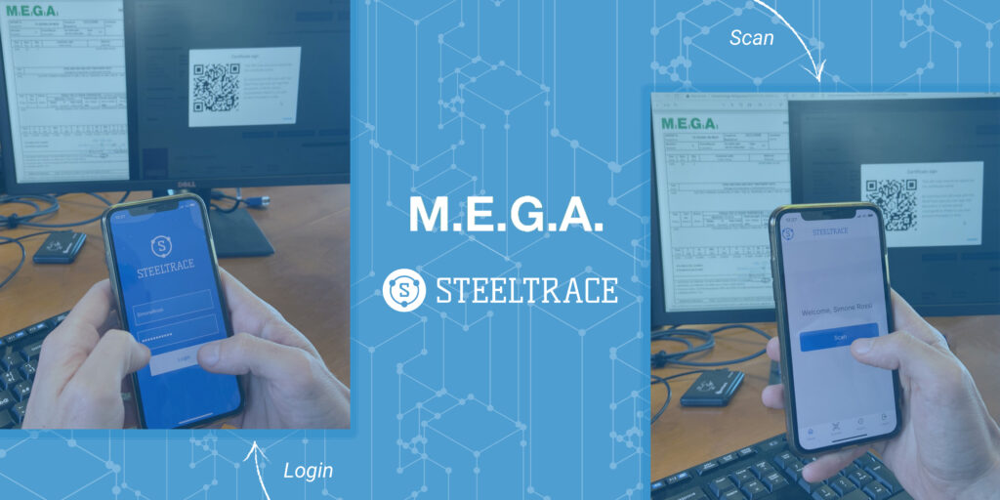
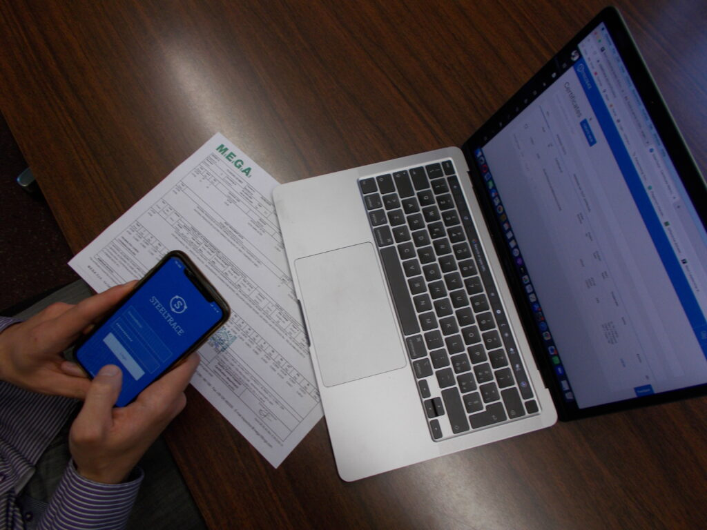
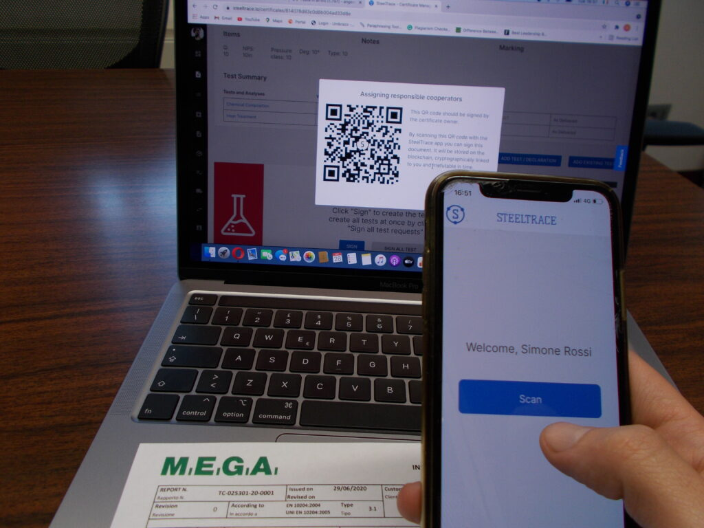

MEGA has been an early customer of SteelTrace since 2018. SteelTrace used the MEGA plant as a test case for the early version of the platform. Now MEGA certifies materials using SteelTrace. It helps them protect their products from counterfeiting as well as providing automated traceability for all steps of the production and testing. SteelTrace aligns with MEGA’s values of transparency and efficiency. MEGA uses the manufacturers module and MEGA labs uses the laboratory module.

Mauro Angeretti, owner of MEGA

“With SteelTrace you **certify products in real time** during the production process. All involved parties van QA/QC, labs and even inspectors all enter the data **directly into the platform** and sign off digitally in real time. All steps are automatically recorded irrefutably in time using blockchain and there for **traceable and transparent** to their customer.”

Simone Rossi QA/QC of MEGA

“We use SteelTrace not only to certify products that we already have in stock, but also to certify new products, and this really shows SteelTrace capabilities! We provide our suppliers with a **SteelTrace portal** where they can upload the material certificates, and then we follow the **complete manufacturing** **process** using SteelTrace modules: splitting, product conversion (i.e. forging), heat treatment, test assignment to laboratories and then final certification (NDE, hydrotest etc.)”

## We all share the same goals

“MEGA was **extremely valuable for SteelTrace** both as a launching customer and a partner providing valuable feedback” Says Tom Meulendijks, Founder of SteelTrace. “Because of their place in the supply chain we could **look at all processes** from purchasing, to manufacturing to certifying”. – Tom Meulendijks, CEO SteelTrace

## Fully integrated process

MEGA manufactures fittings, forgings, and welded items. They buy materials that need to comply with specs, machine, and manufacturer an end product and certify that end product. Everything needs to be traceably and well tested. With SteelTrace this **process is fully integrated** from receiving and verifying raw materials certification to certifying a product. It is all done in one system. It **creates a digital twin** for each batch that follows the products through the production process.

## Completely digital with real time data

The system builds upon the raw material certification, splits it into multiple lots and captures the new production and test data and automatically adds it to the end certificate. MEGA Labs can **feed their data directly into the digital twin** getting rid of PDF documents, report creating, printing. Singing and stamping of certificates. **All is done digitally**, in real time and **without double work.**

## Did we peak your interest?

If you want to learn more on how MEGA uses SteelTrace, please contact [simone.rossi@mega-spa.com](mailto:simone.rossi@mega-spa.com). If you want to know more on what SteelTrace can do for your organization, please contact [tom@steeltrace.eu](mailto:tom@steeltrace.eu). If you want to sign up for the **Live Product Demo**, scan the QR code below.

