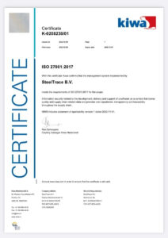

In December 2022 SteelTrace received the ISO 27001:2017 certification. Through an external audit, it has been verified that SteelTrace meets the requirements of ISO 27001:2017 for the scope of: information security related to the development, delivery and support of a software as a service that stores quality and supply chain related data and provides non-repudiation, transparency, and traceability throughout the supply chain.

Last week, we reflected on the motivation that led SteelTrace to get certified, the certification process and its benefits and challenges. In this blog post we share the interview we had with Nick Meulendijks.

### **1.First of all, what motivated SteelTrace to pursue an ISO certification, as it is not a legal requirement in the industry?**

If you want to do business with large enterprises you have to adhere, as a company, to a certain standard when it comes to information security. Especially if there is some kind of connection to their systems, we as a supplier can pose a security risk. Customers don’t necessarily impose a specific framework like ISO 27001, they each have their own set of requirements they want their suppliers to meet. For us the ISO 27001 framework covers most of these requirements, so that became our framework of choice.

### **2****.How long did the ISO certification process take? What steps did SteelTrace take to prepare for the ISO certification audit?**

The actual certification audit took three full days. However the preparation to be fully ready for the audit was around 1.5 years. That included building the necessary processes (Information security management system, ISMS), setting up policies and procedures, making sure they were all running and employees were aware of them, building the management structures in Notion, and finally going through the appendix A index (all the points you need to comply with) to make sure we were ready for the audit.

### **3.Were some processes adjusted to obtain the certification or everything was already set? If processes were adjusted, have you seen any positive/negative changes?**

We had some basic processes in place, as you would expect from a company our size. Generally, a small business has a straightforward, common sense, way of working but in order to comply with the ISO requirements, you need to have everything formalized and documented. Many processes needed to be improved or even set up from scratch. Some processes needed to be a bit more bureaucratic than they would have been if we did not have to be certified. On the other hand it provided us with a good framework to make sure we covered all areas we needed to touch upon. All in all it was a positive experience to become a more mature company.

### **4.Were external consultants involved? Or was the process fully managed internally?**

We had an external expert to guide us through the process, who has a lot of experience in certifying businesses for the ISO 27001 standard. There were a lot of policies and procedures to set up or improve and next to that we needed to comply with the standard. Having someone with experience guide us through this process was important to keep us on the right track towards the actual certification. Eventually the external expert also became our Chief Security Officer so he continues to play an important role in our ISMS (Information security management system).

### **5.What were the biggest challenges SteelTrace faced during the certification process?**

First of all, the biggest challenge for us was the scale and complexity. Many of the policies and procedures needed to be set up and implemented from scratch and an ISMS needed to be implemented. Also the standard does not dictate how to do things, it just states what you have to comply with. It’s up to the company to decide on how to do the implementations, for which some experience can help a lot. We lacked the experience so that was the reason we called in some external help. Lastly it was a challenge to get everybody to be aware of, understand, and be able to work with the new system. It’s one thing to make up policies and procedures, it’s another to have employees actually work with them.

### **6.Overall, what is the internal and external value of the certification? How does it help the company stay competitive?**

The external value is that complying with standards verified by an external audit can give a guarantee to customers. Also, to new customers you can give a guarantee that you can provide them with a certain level of professionality. This lowers the barriers to be able to work with them and therefore can improve the sales process. Internally it forces you to think about and implement formal processes, to work in a more structured and enterprise level way than you would probably initially do in a startup. Then also internally, the value is being more secure as a company. You know that your security measures uphold to a standard, so you are more certain you are working in a secure way.

### **7.Has being ISO certified improved relationships with current or potential clients?**

As I said in the earlier, it is a requirement for certain customers, so it has of course helped in showing we’re a solid company to work with.

### **8.Are there any other certifications that would be interesting for SteelTrace to have?**

In the future if we get more US customers we would like to have the SOC2 certification because it is a US standard, so it will make it easier for them to check our compliance. Then we would like to get certified for ISO 270017, which is a more SaaS oriented standard and more specific to what we do.

### **9.How do you maintain the certification? Are further improvements needed?**

Part of the certification is setting up and maintaining an ongoing improvement process. You need to keep doing management review cycles. There are a lot of recurring tasks and evaluations that happen yearly, quarterly etc.. Also every year there is a recertification audit, in which either the whole system or specific parts are audited again. So basically you need to continuously keep proving that you say what you do and do that you say.

### **10.What advice would you give to other companies pursuing the ISO certification?**

If you’re building a company that needs to be enterprise ready it’s a good way to bring a solid structure into your company. As I said before it also brings value besides just complying with standards, I would recommend going for it when you think you need to make the next step in professionalizing as a company. A good advice is to get in an expert with experience to help you as it is hard and complex to make sure your actual policies and procedures comply with the standard.

