SteelTrace, the data and automation platform for material traceability, has released its latest version, 1.5.9, bringing new features and improvements to its already robust set of tools. This release includes adjustable bins for histograms, the removal of beta status for violin plots, scatter plots for smaller data sets, a new signature timeline, an improved test summary table, and the deployment of the new uploader on coating campaigns.

## Data visualisations

### 1. Adjustable bins for histograms

One of the standout features of this release is the adjustable bins for histograms. This feature allows users to set the number of bins used in a histogram, giving greater control over the presentation of data. With this improvement, users can now accurately represent the distribution of their data in a more granular way.

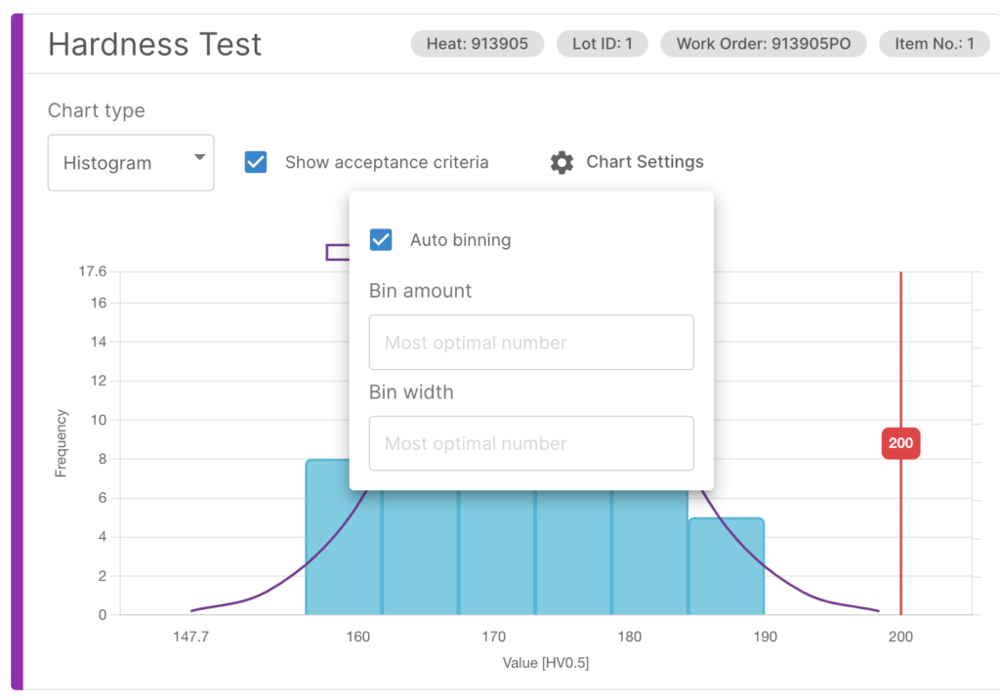

### 2. Violin plots come out of Beta

Another notable feature is the removal of beta status for violin plots. These plots, which provide a more detailed view of a data distribution than a traditional box plot, have been thoroughly tested and are now considered a stable and reliable visualization tool.

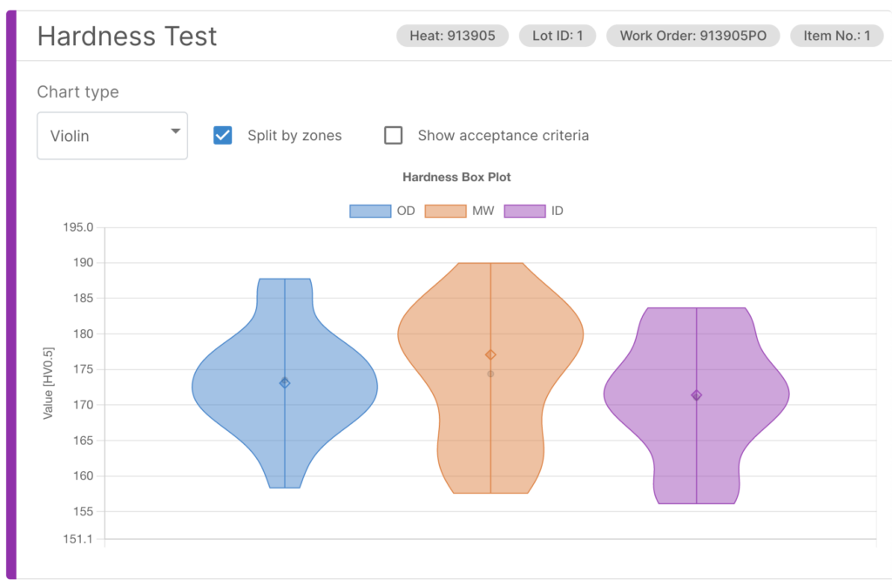

### 3. Scatter plots (for small data plots)

For those working with smaller data sets, the inclusion of scatter plots will be particularly useful. Scatter plots provide a clear and easy-to-read view of the relationship between two variables, making it easier to spot trends and patterns.

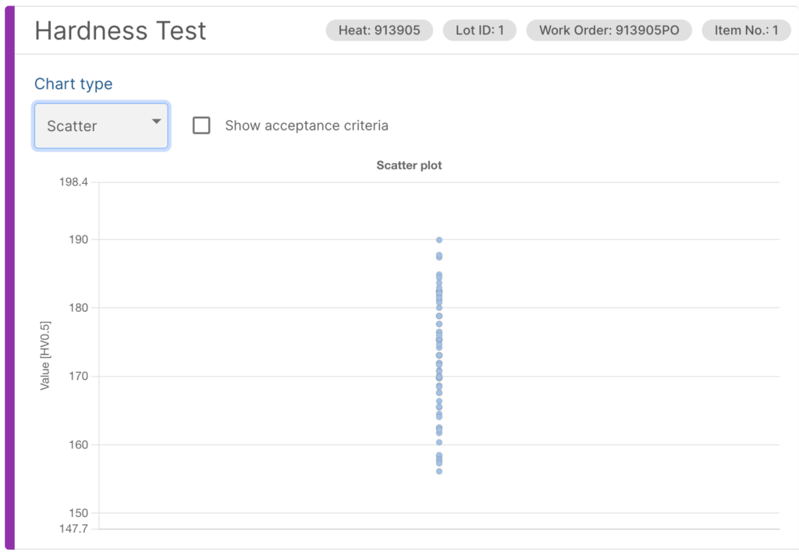

## Interface improvements

### 1. Inviting new people (quick onboarding)

A new feature for quickly inviting new people onto the SteelTrace platform allows users to easily invite new team members via email. The invitation email contains a link that takes the user to the SteelTrace login page, where they can set up their account and begin accessing the platform. This streamlined process helps to ensure that new team members are up and running on the platform as quickly as possible, enabling them to begin contributing to ongoing traceability and compliance efforts without delay.

By simplifying the process of inviting new users onto the platform, SteelTrace is helping to promote collaboration and productivity among team members. With this new enhancement, users can quickly and easily invite inspectors, suppliers, or other external stakeholders onto the platform, enabling them to contribute to ongoing traceability and compliance efforts and stay up to date on project progress. This feature is just one example of how SteelTrace is committed to providing a user-friendly and collaborative platform for the traceability of steel.

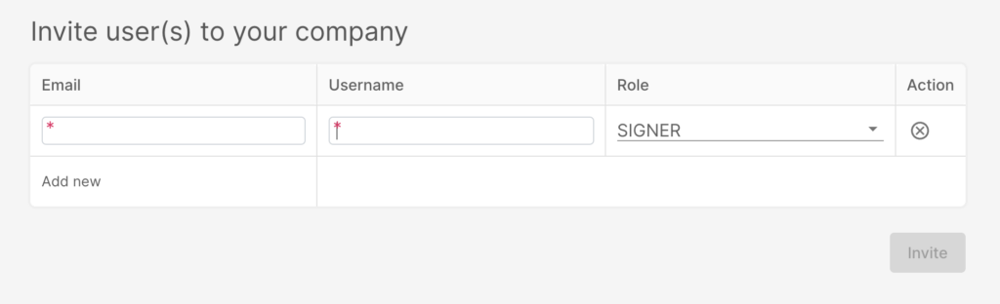

### 2. New signature timeline (showing what signatures are still pending)

One of the standout features of this release is the new signature timeline. Previously, only finished signatures were shown, making it difficult to determine where one was in the process of completing the signature process. However, with the new signature timeline, all signatures, including those still pending, are displayed. This improvement provides users with a more complete view of the signature process and allows them to easily track changes over time. With this enhanced functionality, users can more easily identify potential sources of delay and gain greater insight into the status of the process.

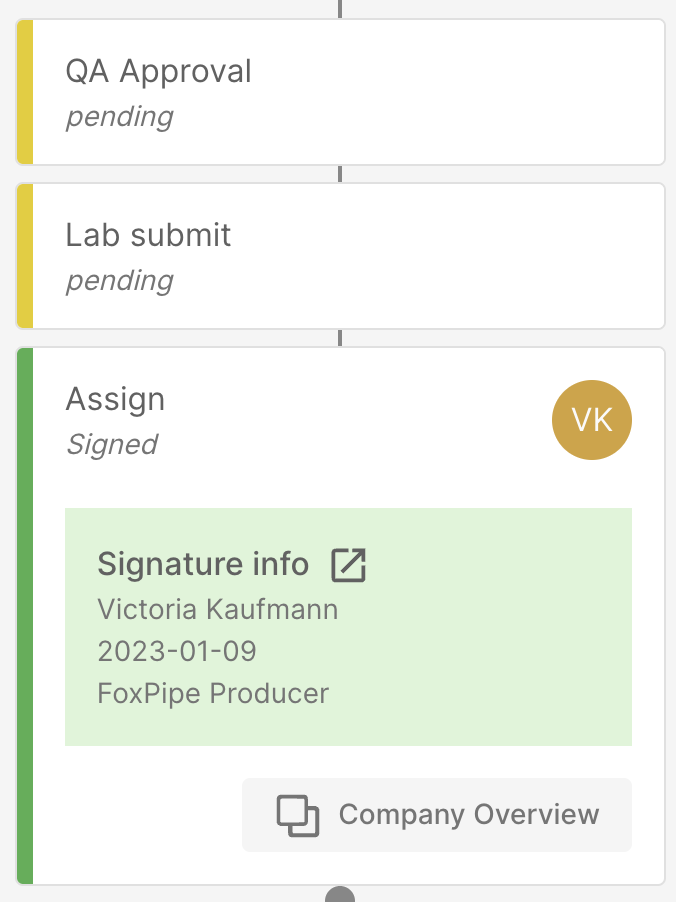

### 3. Test summary table visualisation improvement and filter capabilities

Another noteworthy improvement is the enhanced test summary table, which now includes better labelling and filtering options. The new labels provide instant insight into the status of the test, making it easier to identify and track key data points. Additionally, the test summary table now includes the ability to filter by PO (Purchase Order), PO item, Heat, and Heat lot. These filtering capabilities allow users to easily navigate through large data sets and quickly find the information they need. By utilizing the filters, users can narrow down the data to specific parameters, making it easier to identify patterns or anomalies in the data. Overall, these enhancements to the test summary table provide a more streamlined and efficient way to analyze test data.

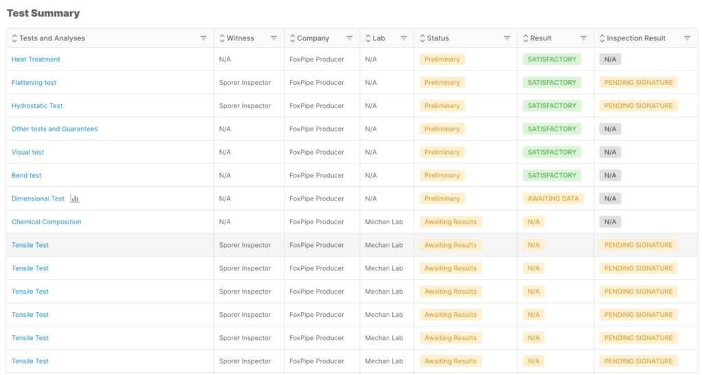

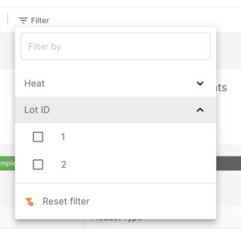

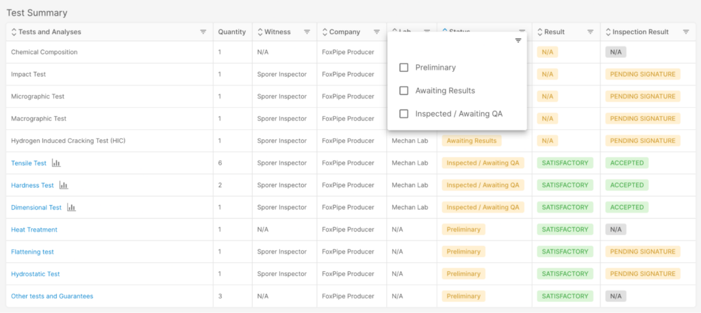

### 4. Improvement on inspector interface for multi-accept

SteelTrace version 1.5.9 also includes two additional features that further improve the platform’s usability. The first is the ability for inspectors to accept and endorse multiple tests with one click. This improvement streamlines the process of completing multiple tests at once, saving time and effort for inspectors. By being able to endorse multiple tests simultaneously, inspectors can complete their work more efficiently and move on to other tasks more quickly.

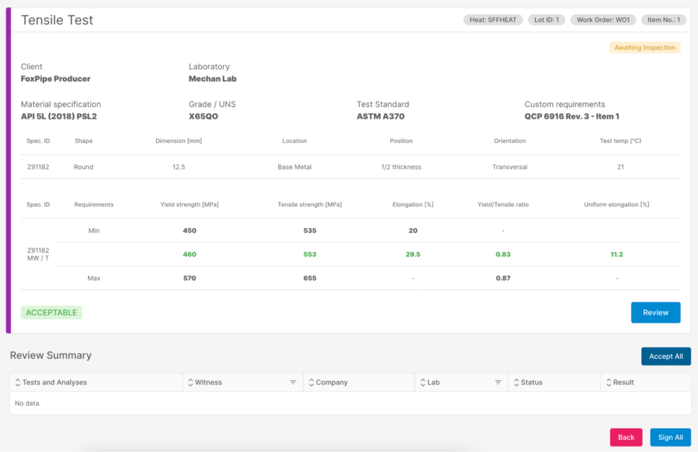

### 5. New chemical composition tables in the lab

The second feature is an improved table for data entry of chemical analyses. With this new feature, users can more easily enter and organize data for chemical analyses, making the process faster and more efficient. The new table provides a more intuitive interface for entering chemical data, and includes additional features such as the ability to copy and paste data from other sources. These improvements streamline the data entry process and help ensure that chemical data is accurately recorded and easily accessible for analysis.

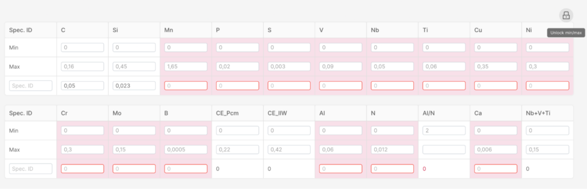

## New features

### 1. V1 of the new uploader deployed on coating campaigns

Finally, the deployment of the new uploader on coating campaigns will streamline the process of uploading and analyzing data from coating campaigns. This uploader is designed to be faster and more efficient than previous versions, allowing users to spend less time on data processing and more time on analysis and interpretation.

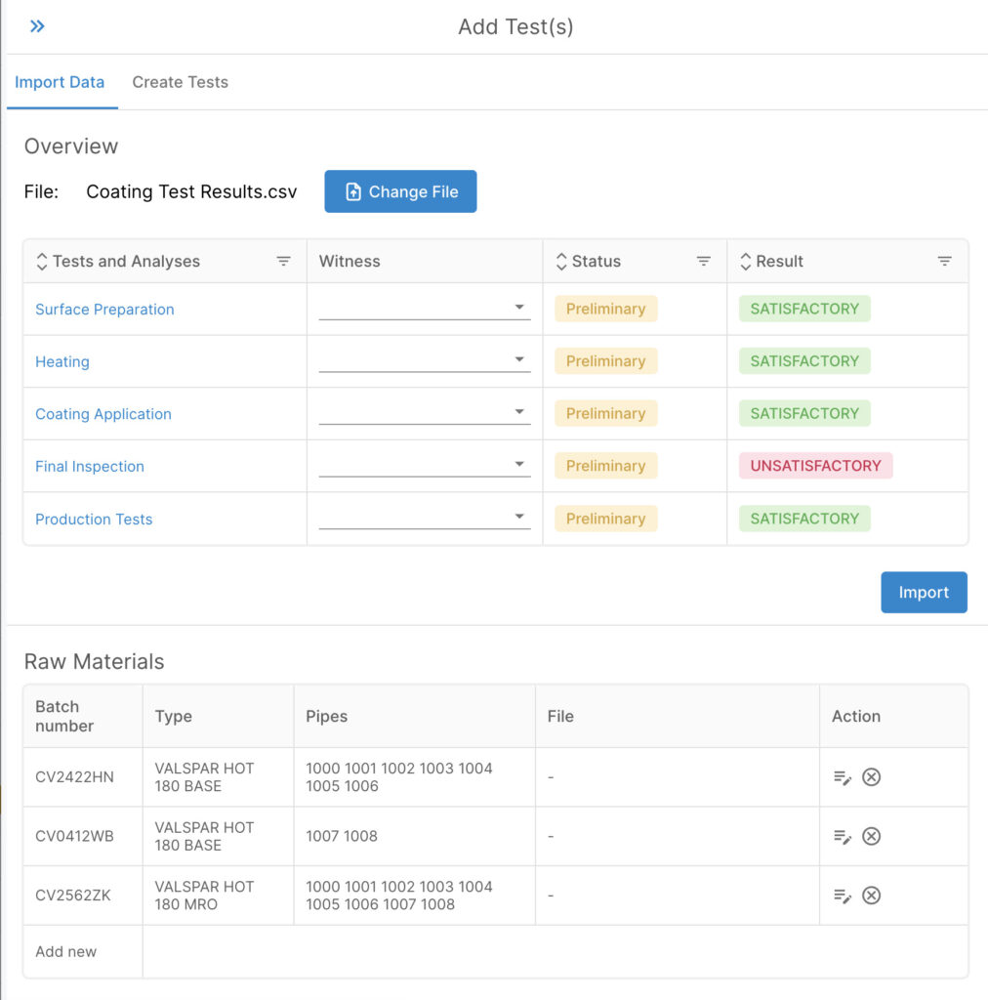

Overall, the release of SteelTrace version 1.5.9 represents a significant step forward in the platform’s capabilities. With these new features and improvements, users can expect to be able to analyze and visualize data more accurately and efficiently than ever before.

## Future developments

In addition to these improvements, SteelTrace is constantly looking towards the future and exploring ways to further enhance the platform’s capabilities. For example, the SteelTrace team is currently working on an exciting new feature that promises to provide a comprehensive view of pipe stalks used in pipe spools for gas pipelines offshore. This feature will include a powerful visualization that provides detailed information about the state of the pipeline, including anode locations, weld data, and coating data. Users will be able to see exactly where in the manufacturing process a particular pipe stalk sheet is, providing a more complete picture of the supply chain.

Currently, the process of tracking pipe stalk sheets in the manufacturing process is typically done on paper or in PDF format. However, SteelTrace’s upcoming visualization feature promises to revolutionize this process, providing a digital platform for tracking and analyzing pipeline data in real-time. By digitizing this process, SteelTrace will enable users to quickly and easily access critical information about pipeline production, helping to identify potential issues and improve overall efficiency. The new feature will offer a user-friendly interface for viewing pipeline data and will be fully integrated with other SteelTrace functionalities, providing a comprehensive solution for pipe spool manufacturing.

### Sneak peak of what is coming: Stalks management

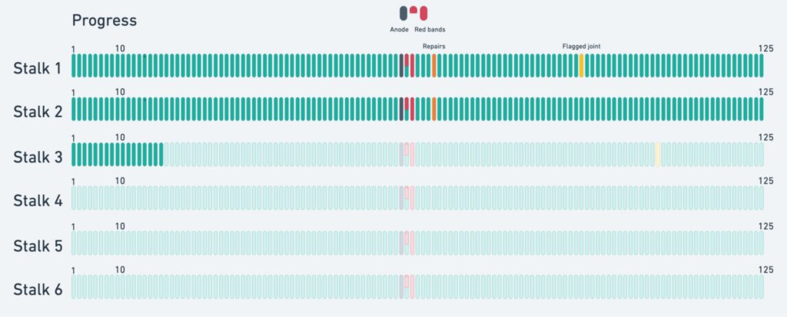

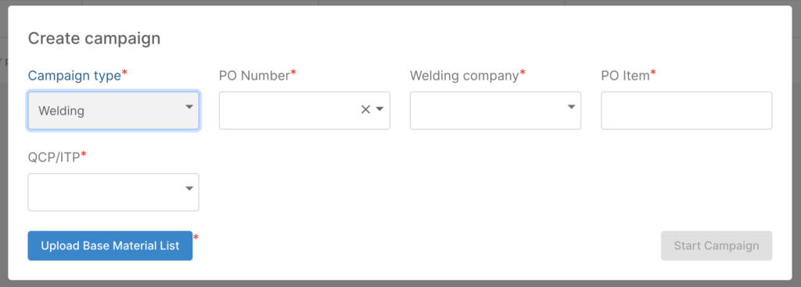

With these new enhancements and upcoming features, SteelTrace continues to establish itself as a leading platform for material science research and development. The platform’s commitment to continuous improvement and innovation ensures that it will remain a powerful and comprehensive tool for operators to have better control of the steel supply chain.
