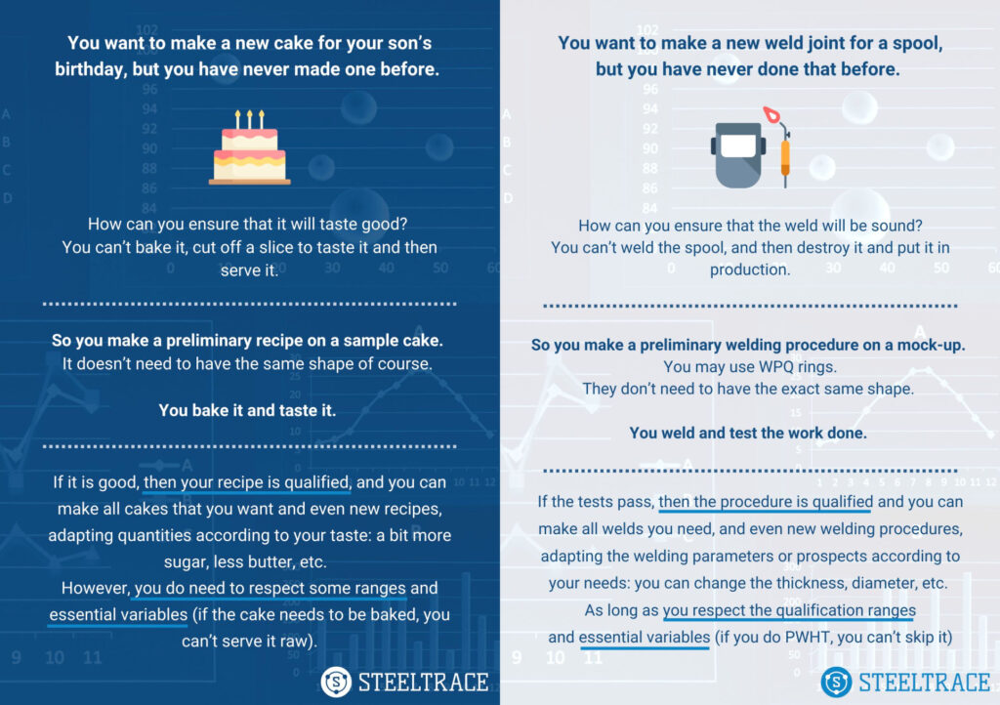

## Making a cake

Now imagine you want to make a cake for your son’s birthday, but you have never made one before and do not know where to start. How can you ensure that it will taste good? You cannot cut off a slice and taste it to check the quality of the birthday cake you have baked.

So you decide to take another approach:

You make a preliminary recipe on a sample cake. It doesn’t need to have the same shape but in this way, you can bake and taste it to make sure that your recipe is good.

If it is good, then your recipe is qualified, and you can make all cakes that you want and even new recipes, adapting quantities according to your taste: a bit more sugar, less butter, etc. However, remember that you do need to respect some ranges and essential variables. For example, if the cake needs to be baked, you can’t serve it raw.

## Making a weld joint

Congratulations for successfully making your cake! Now you need to make a weld joint for a spool, but you’ve never made it before. How can you ensure that the weld will be sound? You can’t weld the spool and then destroy it and put it into production. Don’t worry, you can follow the same step you used to make a cake.

You make a preliminary welding procedure on a mock-up. You can use WPQ rings. They don’t have to have the same shape. You can then weld and test the work done.

If the tests pass, then the procedure is qualified and you can make all welds you need, and even new welding procedures, adapting the welding parameters or prospects according to your needs: you can change the thickness, diameter, etc. As long as you respect the qualification ranges and essential variables. For example, if you do PWHT, you can’t skip it.

As you have seen the two processes are quite similar and easy to follow. So next time you need to make a weld joint you can think about making a cake!

If you want to read more about welding, make sure to also read our blog post about [5 tips for making welding procedures.](/blog/5-tips-for-making-welding-procedures/)
