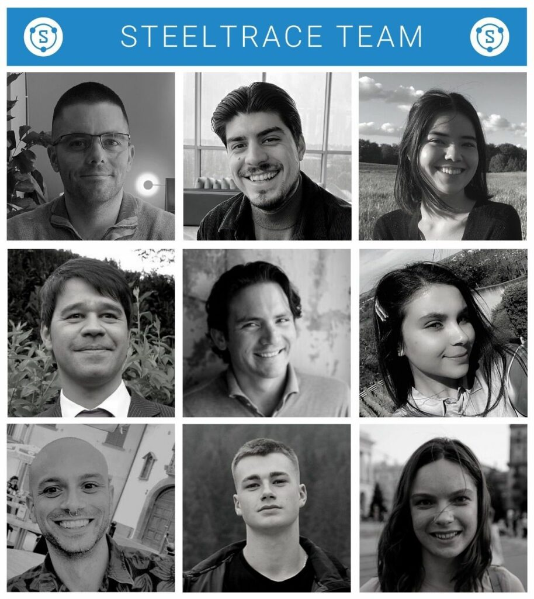

## New clients and projects

We signed a second **energy major**and executed a project with them on a **large line pipe order**. Signing a second major proves our core business case and gives us extra motivation and energy to move forward and push on.

SteelTrace is now capable of capturing quality related data in real-time, verifying it automatically against the QCP and capturing inspector sign offs and release notes digitally, during the manufacturing process. The efficiency gained, as well as the long term value created for the manufacturer and the end owner were significant to say the least.

## New team members

During last year, we had the chance to **expand the SteelTrace team** and welcome new team members**across all functions.**

First, the development team grew by two members: Dimitrios, our blockchain developer with a focus on building secure and scalable applications and Artem, our full stack developer with a passion for complex enterprise web solutions.

As SteelTrace is rapidly developing, we also needed more in-house expertise and welcomed Simone, our subject matter expert, who has deep knowledge in the oil & gas field and is helping us understand materials, specifications, tests and workflows of manufacturers. Gilbert also joined the team, as our data protection & information security officer who audits and improves our internal security processes.

We also decided to build a marketing & sales team, with two current members: Minako, our marketing & sales assistant and Nadin, our marketing & sales intern.

Last but not least, Nick officially joined the SteelTrace team to take care of the Operations and Finance. He is responsible for all our general business processes (i.e., HR, quality management, customer support and finance).

## Offers to major players in the Oil & Gas industry

2022 looks promising as we already made offers to a**3rd energy major and one of the largest EPCs in the world**. Our goal: reaching a critical mass on the end-owner / EPC front and use that traction as a catalyst to persuade more manufacturers to join the platform.

## New platform features

Here is a summarised list of all the new (and improved) features developed and implemented by our team in the SteelTrace platform:

- Inspector release notes
- CSV importer
- Norm database expansion
- Adding work order tracker
- Spec checker expansion
- Multi-group endorse (allows grouping documents to sign at once)

If you want to know more about these features, make sure to sign up for a product demo! We have one every Thursday and you can register using the link below:

[steeltrace.co/weekly](/weekly/)
