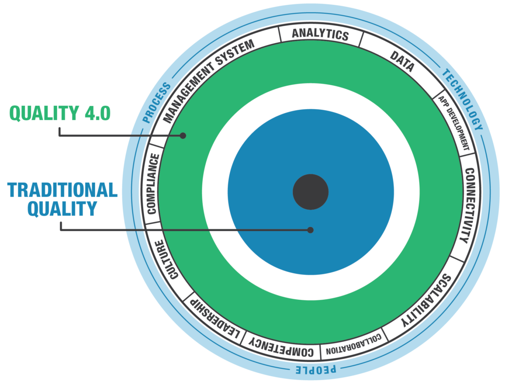

## What is Quality 4.0?

The growth of modern technologies and the development of traditional management capabilities have been shaping a new quality management approach in the industry 4.0, referred to as Quality 4.0. Some examples of technologies used are Artificial Intelligence, Cloud Computing, Augmented Reality, Virtual Reality, Blockchain and more. The focus of Quality 4.0 is to digitize systems and processes to achieve efficiency and optimization. However, even though technology is a major aspect of Quality 4.0, it is much more than that. It is about collaboration, leadership, and management. Indeed, Quality 4.0’s value proposition is to augment, rather than substitute, human intelligence.

## How is it different from traditional quality management systems?

Quality 4.0 combines traditional methods together with technology. This means that Quality 4.0 does not replace traditional quality management systems but enhance them in combination with the technological advancements of Industry 4.0.

*Source:* [https://cdn2.hubspot.net/hubfs/136847/Quality%204.0.png](https://cdn2.hubspot.net/hubfs/136847/Quality%204.0.png)

## And what about the steel supply chain?

As we already mentioned, Industry 4.0 is impacting all industries, and the steel supply chain is no exception. There are indeed a lot of opportunities that the steel industry can leverage from adopting a Quality 4.0 approach:

### 1. Data integrity

Technologies used in the Industry 4.0 provide data integrity. This is achieved thanks to digitization and the use of real-time data, which ensure that that the information is accurate, complete, consistent and reliable.

### 2. Traceability

Quality control in the Industry 4.0 enables complete and instant traceability of the data. By using technologies, such as blockchain, every step in the supply chain can be traced and reviewed for quality specifications.

### 3. Transparency

Improving transparency across the entire supply chain is challenging, but it can be achieved with Quality 4.0 tools. Indeed, they ensure that no data in the system can be altered unless every party agrees to it. Collaboration across the supply chain is therefore essential. This means that no more fake certificates or signatures can be made.

### 4. Safety

Data can be used to detect why and where malfunctions in the machines occurs, allowing for repairs in time and anticipating and preventing potential failures. This grants a safer and more efficient workplace and makes safety and quality management simple.

### 5. Speed

Through digitalization, processes can be carried out significantly faster as they can be automated and do not require employees to go through documents manually. In addition, human errors are reduced, and quality is increased.

If you want to know more about this topic and listen to our talk with Mark Walsh, an expert in the field of Quality and Supply Chain Management, check out the video below:



**If you want to know more about the SteelTrace solution, make sure to sign up for a product demo! You can register at your preferred time using the link below:**

[Sign up for a Product Demo](/demo/#book-demo)
