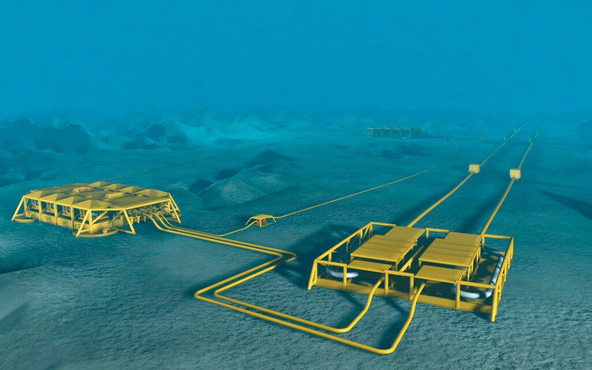
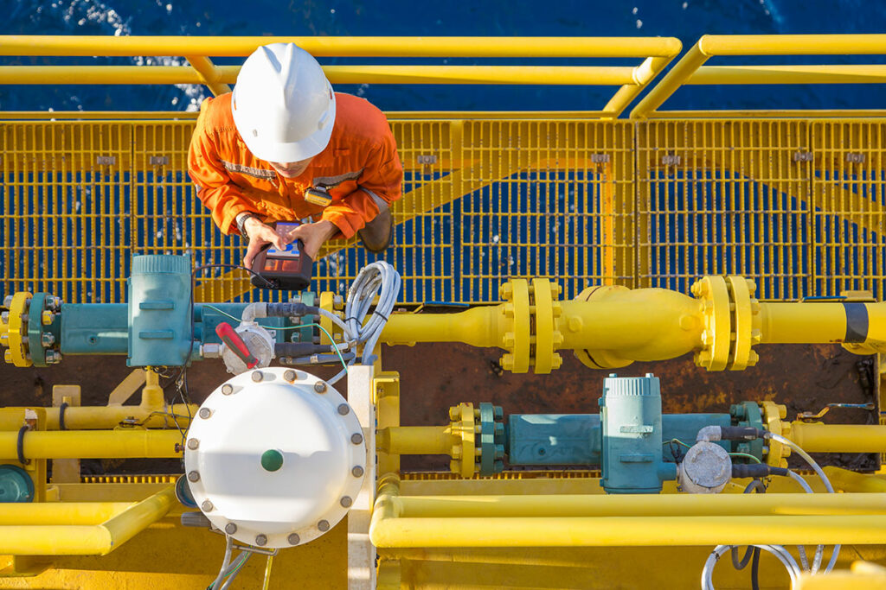

Oh shucks. You have just bought the groceries, loaded them into the car, inserted your key in the ignition, turned it – and nothing happens. You have a flat battery! And, like Monty Python’s dead parrot, it is not asleep but deceased, no more, its death both unpredicted and unpredictable; and you have to get it replaced immediately. But wait! Tomorrow you were supposed to leave in the car for your holiday, so fixing the car will disrupt your holiday plans.

We have all been in a similar situation. Suddenly time that had been allocated to pleasant or productive activities has to be re-allocated to deal with a short-term emergency. If only you had known in advance, you could have made space in your busy diary to solve the problem! And you would be mentally prepared!

It is not just that breakdowns are annoying, it is the fact that they often occur when least convenient. This is why predictive/smart maintenance has become a multi-billion-dollar industry. Or rather, partly the reason. The main factor is that information technology has now reached a point where smart maintenance is easier to achieve than before: sophisticated models can be devised for predicting and forestalling breakdown or efficiency losses so that maintenance can be scheduled with minimum disruption. Huge amounts of time and money are at stake.

## Smart Maintenance

Smart maintenance has been summed up in the four “Ps”: “Productive,” “Preventive,” “Predictive” and “Prescriptive”. There is even an equation, “Performance x Availability x Quality”, to measure “Overall Equipment Effectiveness”, a concept developed by Toyota (1). A distinction is made between predictive maintenance, which is scheduled as needed, based on the asset’s condition; and preventative maintenance, which is scheduled regularly, “just in case”. Predictive maintenance uses machine learning to organize the data transmitted by sensors concerning an asset’s condition, data that can be used to schedule maintenance.

Smart maintenance relies on recent advances in IT, especially Big Data (huge amounts of data that can be analyzed to craft strategies and schedules for the maintenance and optimization of equipment) and the Internet of Things (objects that can “talk” to another in a network, conveying vital information about their life cycle and efficiency). As Artificial Intelligence (AI) advances, the scope for smart maintenance will increase accordingly. Automation, with corresponding use of equipment such as sensors, drones and robots, is at the heart of this development.

The oil and gas industry is among those with the most to lose in the event of unforeseen accidents or maintenance issues, whether at sea, where the cost of a cleaning up a spill can be prohibitive, or on land, where a burst pipeline can damage the environment. Installations can be hard to access, in remote locations, or exposed to fragile environments. This is why drones, robots and remotely operated vessels are increasingly being used for inspection and maintenance.

Petroleum companies that have invested heavily in smart maintenance include Shell, BP, Exxon Mobil, Equinor, Chevron, Rosneft, Total, ConocoPhillips and Repsol. These companies are reducing operational costs by collaborating with software companies and using AI- and IoT-based diagnostics to predict possible failures.

## Corrosion prediction

An important area in which software tools have made a difference is corrosion prediction. This is just as well, as corrosion is thought to cost 2 trillion euros per year world-wide. Numerous software programs exist that model, predict and monitor corrosion in all manner of conditions. Sensors placed in out-of-the-way places such as process tanks or containers can transmit real-time corrosion rate data to a distant location, where data from multiple sources is amassed, collated and analyzed. A “virtual expert” can define safe operating conditions for a given material and estimate the lifetime of materials in specific conditions. This is happening thanks to collaborations across the supply chain, for example Cortools, supported by the EU, in which Ferritico and Outokumpu Stainless participate.

## Revolutionizing inspections

The ongoing lockdowns have accelerated a trend that was already under way, that of harnessing IT in planning plant maintenance and optimization. The need to work remotely is revolutionizing inspection of oil and gas fields. Shell recently inspected the Ormen Lange gas field not by the traditional method of sending out a crew on a trawler, but with a smaller, remotely controlled catamaran operated from an employee’s kitchen table. The vessel, called X-07, communicated with the acoustical modems of sensors monitoring the seabed; the data was then sent to the sensor maker for verification, before being transferring to Shell geophysicists working from home in Stavanger. Long after the Covid restrictions are lifted, these savings in time, personnel and emissions will ensure continued use of this kind of technology.

The Nyhamna gas termimal at Ormen Lange provides a good example of what digital technology can achieve in enhancing safety and efficiency. In 2019 Kongsberg and Shell decided to create a digital “twin” of the facility, a virtual representation of its behaviour that can be continuously updated with information reflecting its status in real time. This “dynamic digital twin” can yield insights that will help improve productivity, allowing the operators to simulate scenarios and uncover new ways of optimizing the facility.

Not only in the field, but also in ships and pipelines, smart maintenance techniques are making a difference. Exxon Mobil is using WinGD’s Integrated Digital Expert (WiDE) predictive maintenance technology to gain insight into how its ship engines are working. New regulations impose a limit of 0.5% on sulphur emissions, and flue bed desulphurizers (scrubbers) made of nickel alloys are used to reduce pollution. The new software measures sulphur content and ensure engine optimization in other ways.

A final example illustrates that not only software can be smart, but materials also! Pipeline corrosion is still a major headache, with hard-to-predict ruptures causing major loss of life and damage. Because of the length of these pipelines, the cost of using sensors or using corrosion-resistant alloys can be prohibitive. It is therefore essential to have some idea of where the next rupture is likely to occur.

This is why “smart coatings” are being developed that can “talk” to pipeline operators to warn of trouble ahead. Coatings used to protect pipelines were formerly made of such materials as coal tar and asphalt, petroleum wax and fibre mesh. Nowadays, fusion-bonded epoxy and multilayer composites are standard. However, these can damage the environment, and they degrade over time. These factors, plus the remote locations of most pipelines, are driving research into new technology, including the use of nanotechnology to produce self-healing coatings. Going a stage further, researchers are developing coatings that contain microcapsules that burst when damage occurs, causing a change of colour that makes danger points clearly visible.

## Traceability and data from the supply chain

Expected life cycles and corrosion rates under given conditions are properties that end users need to know in advance of material selection. In order to better predict the the lifetime of a product you need data about how it was manufactured. Blockchain technology of the type offered by SteelTrace offers a secure, transparent way of generating and storing this data, bringing peace of mind to all players in the supply chain. Two further advantages of blockchain are that it is virtually impossible to commit fraud or tamper with documents; and human error is less likely to occur, as the data is secured and automatically verified.

The properties of the steels used form part of the essential data or “DNA” that uniquely characterizes products and gives them value not only during their life cycle but also for their recovery, recycling and re-use. All this underlines the importance of material passporting, the subject of a forthcoming blog.

Meanwhile, if your car breaks down, don’t worry: worse things happen at sea!

### References / Footnotes

*(1) Setrag Khoshafian and Carolyn Rostetter of Pegasystems Inc., USA, “Digital prescriptive maintenance: disrupting manufacturing value streams through Internet of Things (IoT), Big Data, and Dynamic Case Management”: [www.pega.com](https://www.pega.com/).*
