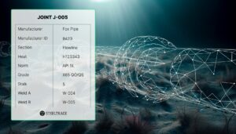

SteelTrace, is pleased to announce a significant achievement in collaboration with Subsea7. This partnership marks a milestone as SteelTrace embarks on its first pipeline project in the North Sea, reinforcing its commitment to increasing efficiency and quality standards while meeting the digital needs of the operator.

SteelTrace is a pioneering quality management automation platform that revolutionises transparency, traceability, and efficiency in the steel supply chain. Focusing its efforts in the chemical and petrochemical industry using state-of-the-art technologies including blockchain and cloud computing to seamlessly integrate quality management throughout the entire steel supply chain – from cradle to grave.

By offering an end-to-end solution that ensures transparency and accuracy, SteelTrace enables manufacturers, suppliers, and stakeholders to maintain complete confidence in the quality of steel products needed for demanding applications in the oil and gas industry.

Testament to its relationship with Subsea7, this is the second project the companies have collaborated on. This collaboration will see SteelTrace capturing vital structured data from manufacturers and automatically cross-referencing it against project requirements. This advanced functionality eliminates the need for any manual reviews, streamlining the process and reducing the possibility of human errors. Converting this data into a digital manufacturing record book, promises increased efficiency and a streamlined workflow. Ultimately benefiting the entire supply chain including the operator, who can use the collected data for the life extension studies, root cause analyses and turnaround simulations.

In these challenging sea environments, steel pipes must be able to withstand harsh conditions and stringent safety standards. The complexities of seabed dynamics and the need for precise welding require an increased level of quality control and precision. SteelTrace’s comprehensive data capture ensures that all crucial information is meticulously recorded, eliminating the need for time-consuming manual data review, and providing the industry with a reliable and efficient alternative.

SteelTrace’s CEO and Founder, Tom Meulendijks, expressed his enthusiasm for the collaboration, stating, “As SteelTrace continues to push the boundaries of quality assurance and digital transformation within the steel industry, we are excited to secure our second project with Subsea7. Since our establishment in 2017, SteelTrace has developed a global client portfolio spanning Europe, the US, South East Asia, and upcoming ventures extending to Australia.

SteelTrace Digital Material Passport

***Issued on behalf of SteelTrace by thinkPR. For further information contact Hollie Knox on*** [hollie@thinkpr.co.uk](mailto:hollie@thinkpr.co.uk)

**About SteelTrace**

SteelTrace is a platform that gathers all quality related data of steel products in real-time for easy access for the end-user. All test data, digital signature, witness signatures are available and securely verified with blockchain technology. SteelTrace has developed a full suite of software for all the different players in the supply chain, enhancing supply chain provenance and boosting digital transformation.
