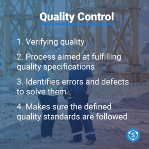
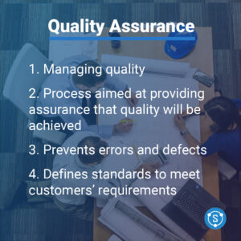

## Quality Assurance (QA)

Quality assurance is aimed at managing quality, meaning that it involves establishing processes and standards to ensure that the materials are of [high quality](/blog/6-reasons-why-material-testing-is-crucial/). The task involves defining the standards that need to be implemented in the production in order to meet customers’ specifications. This includes setting up procedures to ensure that the products meet requirements and safety standards. The process also ensures that errors and defects are prevented throughout the whole steel supply chain. To sum up, quality assurance uses a proactive approach that aims to identify the right quality standards and address potential issues before they can become actual problems during production.

## Quality Control (QC)

On the other hand, quality control aims at verifying quality. The process involves fulfilling the quality specifications defined by quality assurance and detecting and addressing defects in the products after they have been produced. This includes inspecting and testing the materials to ensure that the defined quality standards are followed. In summary, quality control is a reactive approach that aims to identify and fix issues that have already occurred through inspection and testing.

We can see that, despite both aiming at achieving high quality, QA and QC are two very distinct processes that comprise different responsibilities and tasks. The energy sector has several standards and requirements that keep evolving and changing, which pose several challenges for QA and QC managers. This is where SteelTrace comes in. The platform offers an integrated workflow for QA and QC, in which structured data is shared in a standardized format for every party in the supply chain. This allows for automated check of data end, [review trends in the material properties](/blog/how-box-plots-and-violin-plots-can-be-used-to-ensure-material-quality/), which makes the process of QA and QC more time-efficient and accurate.

 

## What does SteelTrace do?

SteelTrace does more than offer a workflow. We are reinventing the future of quality management as we believe the data element will significantly change [how QA/QC is done in the future.](/blog/the-future-of-quality-management-in-the-energy-sector/)
